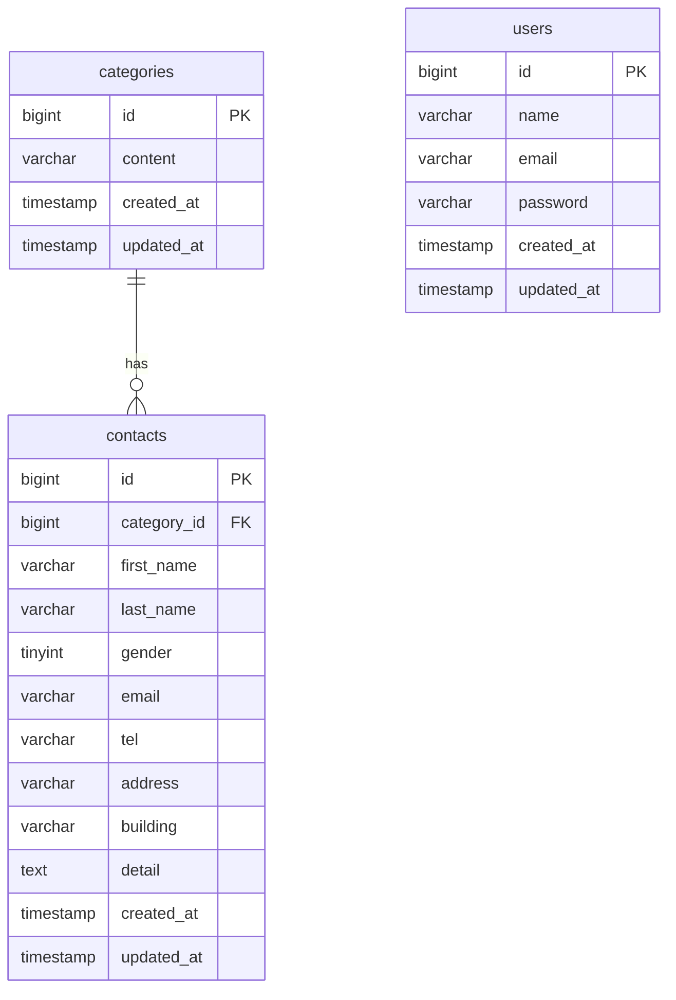

# お問い合わせフォームアプリ

お問い合わせ内容の入力、確認、送信ができるフォームアプリです。
管理画面では、登録されたお問い合わせの一覧表示、検索、詳細表示、削除、CSVエクスポートができます。

---

## 環境構築

### 1. Dockerビルド

```bash
git clone https://github.com/Asaky250816/contact-test.git
cd contact-test
docker compose up -d --build
```

### 2. Laravel環境構築

```bash
docker compose exec php bash
composer install
cp .env.example .env
```

### 3. .env ファイルを以下のように編集してください：

```env
DB_CONNECTION=mysql
DB_HOST=mysql
DB_PORT=3306
DB_DATABASE=laravel_db
DB_USERNAME=laravel_user
DB_PASSWORD=laravel_pass
```

### 4. 設定後、以下のコマンドを実行してください。

```bash
php artisan key:generate
php artisan migrate
php artisan db:seed
```

---

## 使用技術（実行環境）

- PHP 8.1
- Laravel 8系
- MySQL 8.0
- nginx 1.21.1
- Docker / Docker Compose

---

## 主な機能

- お問い合わせ入力機能
  - バリデーション
  - 確認画面
  - サンクスページ
- 会員登録機能
- ログイン機能
- ログアウト機能
- 管理画面一覧表示
  - 検索機能
  - ページネーション
  - 詳細モーダル表示
  - 削除機能
  - CSVエクスポート機能

---

## URL

- 開発環境: http://localhost/
- phpMyAdmin: http://localhost:8080/

---

## ER図

> ※ `users` テーブルは認証用の独立テーブルです。
> ※ `contacts` テーブルは `categories` テーブルに従属しています。



